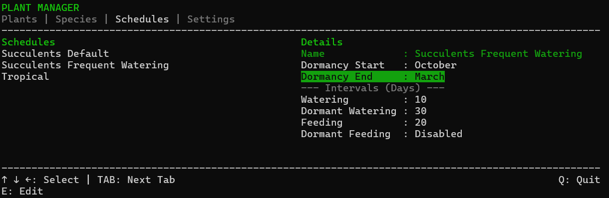
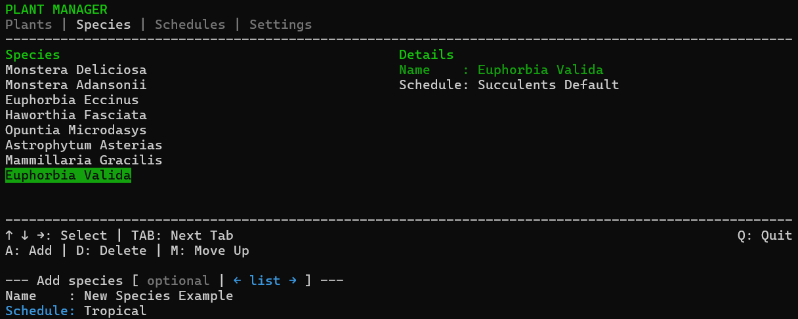
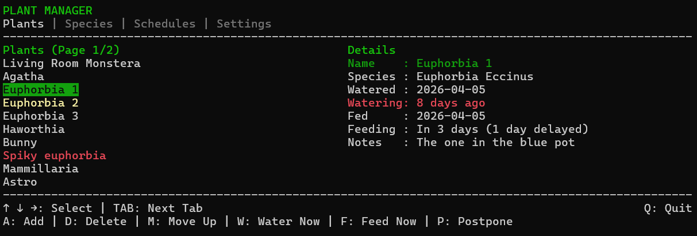

# PlantManager – C++ House Plant manager with a windows console TUI
A relatively simple manager to help tracking, managing and supporting plant care.
Data is stored using SQLite3 relational database and all key operations and errors are stored in a .log file.

## Data structure
### Schedule

Schedule contains dormancy period as well as watering and feeding (fertilizing) intervals.
### Species

Species link plants to schedule, as well as simply defining the plant species.
### Plants

Plant is the main object. Each plant has a relation to species, which defines it's schedule.
Watering and feeding is tracked and reminded based on calculated schedule.
Watering/feeding can be manually postponed for later. 
Each plant can have individual name and individual notes (unrelated to species).

## Controls
All controls (based on current state and tab) are displayed in the footer - hopefully they are pretty straight forward and don't need further elaboration.

## Build
### Using CMake Presets 
Creates a /build folder with .exe inside.
This will also run unit tests during build.
```bash
cmake --preset default
cmake --build build --preset buildAndTest
build\PlantManager.exe
```
## Sample
Rename sample.db to PlantManager.db, put it in the .exe directoryu and run the program with sample data to get a quick preview.
## License
This project is open source under the [MIT License](LICENSE).
